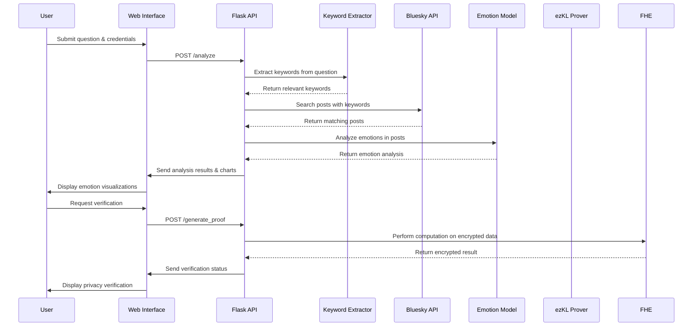

<div align="center">

# 🔏 Privacy-Preserving Emotion Analysis

[](https://www.python.org/downloads/)
[](LICENSE)
[](https://huggingface.co/transformers/)
[](https://github.com/OpenMined/TenSEAL)
[](https://flask.palletsprojects.com/)
[](https://spacy.io/)
[](https://www.chartjs.org/)

<p align="center">
  
</p>

Analyze emotions in Bluesky posts with advanced NLP and protect privacy using Fully Homomorphic Encryption

</div>

## Table of Contents

- [🔍 Overview](#-overview)
- [✨ Features](#-features)
- [🏗️ Architecture](#️-architecture)
- [🔄 How It Works](#-how-it-works)
- [🛠️ Technologies Used](#️-technologies-used)
- [🚀 Getting Started](#-getting-started)
- [📘 Usage](#-usage)
- [🖼️ Screenshots](#️-screenshots)
- [🔒 Privacy Features](#-privacy-features)
- [🤝 Contributing](#-contributing)
- [📄 License](#-license)

## 🔍 Overview

This project implements a privacy-preserving emotion analysis system for Bluesky posts using Fully Homomorphic Encryption (FHE). It allows users to analyze emotions related to specific questions or topics without revealing the actual posts or the emotion analysis model. The system detects 7 distinct emotions (joy, sadness, anger, fear, surprise, disgust, neutral) using a DistilRoBERTa model and visualizes results with interactive charts.

## ✨ Features

- **Advanced Keyword Extraction** using spaCy NLP for better post relevance
- **Nuanced Emotion Analysis** with DistilRoBERTa detecting 7 emotions
- **Privacy Protection** using TenSEAL for Fully Homomorphic Encryption
- **Interactive Visualizations** with Chart.js
- **User-Friendly Web Interface** built with Bootstrap
- **Command-Line Interface** for automated processing
- **Automatic Setup** with a single batch file

## 🏗️ Architecture


## 🔄 How It Works



## 🛠️ Technologies Used

- **Frontend**: HTML, CSS, JavaScript, Bootstrap 5, Chart.js
- **Backend**: Python 3.8+, Flask
- **Machine Learning**:
  - Transformers (DistilRoBERTa)
  - spaCy (NLP)
  - ONNX (Model export)
- **Privacy**: TenSEAL for Fully Homomorphic Encryption
- **API Integration**: Bluesky atproto
- **Visualization**: Matplotlib, Chart.js

## 🚀 Getting Started

### Prerequisites

- Python 3.8 or higher
- Bluesky account (for authenticated API access)
- Windows (for .bat script) or compatible environment

### Installation

1. **Clone this repository**:
   ```bash
   git clone <repo-url>
   cd encode-zkML-bootcamp-project
   ```

2. **Quick Setup (Windows)**:
   ```bash
   setup_and_run.bat
   ```
   This script will create a virtual environment, install dependencies, export the model, and start the web server.

3. **Manual Setup**:
   ```bash
   # Create and activate virtual environment (optional)
   python -m venv venv
   source venv/bin/activate  # On Windows: venv\Scripts\activate

   # Install dependencies
   pip install -r requirements.txt

   # Download spaCy model
   python -m spacy download en_core_web_sm
   ```

4. **Export the emotion analysis model**:
   ```bash
   python src/main.py --export-model
   ```

5. **Prepare the FHE environment**:
   ```bash
   python src/main.py --prepare-fhe
   ```

## 📘 Usage

### Web Interface

1. **Start the web application**:
   ```bash
   python run_web_app.py
   ```
   Then open your browser and navigate to `http://localhost:5000`

### Command-Line Interface

1. **Analyze emotions for a question (CLI mode)**:
   ```bash
   python src/main.py --question "What do people think about AI?" --username your_bluesky_username --password your_bluesky_password --visualize
   ```

## 🖼️ Screenshots


## 🔒 Privacy Features

- **Input Privacy**: The Bluesky posts are not revealed to the verifier.
- **Model Privacy**: The emotion analysis model weights remain confidential.
- **Computation Integrity**: Fully Homomorphic Encryption ensures that the emotion analysis is performed on encrypted data without revealing the inputs.

## 🤝 Contributing

Contributions are welcome! Please read the [contributing guidelines](CONTRIBUTING.md) first.

## 📄 License

This project is licensed under the Unlicense. See the [LICENSE](LICENSE) file for more details.
